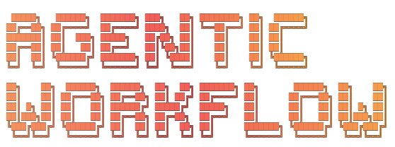

Claude Code ile yazılım geliştirmenin tüm yaşam döngüsünü yöneten bir workflow sistemidir. Görev planlamadan code review'a, bug fix'ten deploy kontrolüne kadar her adımı yapılandırılmış komutlar, ajanlar ve otomatik koruma mekanizmalarıyla yönetir.

Mevcut bir projeye entegre edebilir veya sıfırdan yeni bir proje başlatabilirsiniz. `/bootstrap` komutu projenizi tanır (veya greenfield modunda stack bilgilerini sorar), sizinle kısa bir röportaj yapar ve projenize özel workflow dosyalarını üretir.

## Ne Sağlar?

- **Otonom görev yönetimi** — Backlog'dan görev al, planla, implement et, test et, commit et, kapat. Tek komutla.
- **Otomatik code review** — 3+1 agent ile her değişikliği inceler: kod kalitesi, sessiz hatalar, regresyon riski. Güvenlik değişikliklerinde koşullu Devils Advocate perspektifi.
- **Akıllı bug fix** — Root cause analizi, maks 3 hipotez, minimal fix, regresyon testi. Sonsuz derinliğe dalmaz.
- **Deploy güvenlik ağı** — Push öncesi kontrol, deploy sonrası doğrulama, rollback rehberi. Kontrol adımları deploy platformuna göre değişir (Docker/Coolify: migration + Docker build; Vercel: TypeScript + edge-runtime). Git hook'larının etkinleştirilmesini gerektirir (bkz. Bootstrap Akışı adım 8).
- **Proje-spesifik kurallar** — Stack'inize göre hook'lar, framework kuralları ve koruma mekanizmaları otomatik üretilir.
- **Canlı oturum izleme** — Birden fazla Claude Code oturumunu tek terminal ekranından takip edin.
- **Worktree-dostu mimari** — Agentbase/Codebase ayrımı ile tek config, çok worktree, paralel geliştirme.

## Temel Yaklaşım

Bu repo dört ana çalışma alanı üzerine kuruludur:

| Yol | Amaç |
| --- | --- |
| `Agentbase/` | Şablonlar, üretim mantığı, Claude komutları ve yardımcı araçlar |
| `Codebase/` | Üzerinde çalışılacak gerçek proje kodu |
| `Docs/agentic/` | Bootstrap tarafından üretilen manifest dosyası (`project-manifest.yaml`) |
| `backlog/` | Görev yaşam döngüsü — Backlog.md CLI ile yönetilen task'lar |

Bu ayrımın iki önemli sonucu vardır:

- Git işlemleri hedef proje tarafında, yani `Codebase/` içinde yürür.
- Bootstrap süreci `Codebase/` dizinine yazmaz; üretimi `Agentbase/`, `Docs/agentic/` ve root `backlog/` altında yapar.

### Worktree Avantajı

Agentbase/Codebase ayrımı git worktree ile paralel geliştirmeyi mimari olarak hedefler. Şu anda komutlar sabit `../Codebase` yolunu kullanır; farklı worktree'ler arası geçiş mekanizması henüz mevcut değildir:

```
Agentbase/                  ← SABIT — tüm worktree'ler aynı config'i kullanır
│
├── .claude/commands/       ← Kurallar, hook'lar, agent'lar TEK yerde
├── .claude/hooks/
├── .claude/rules/
│
Codebase/ → proje (main)    ← Ana worktree
Codebase/ → wt-feat-auth    ← git worktree add (feature/auth branch)
Codebase/ → wt-feat-pay     ← git worktree add (feature/payment branch)
```

Geleneksel yapıda `.claude/` proje kökünde yaşar; worktree oluştururken her birinde ayrı `.claude/` kopyası oluşur, config değişiklikleri senkronize olmaz. Agentbase ayrımı bu sorunu kökten çözer:

- **Tek config, çok worktree** — Hook'lar, kurallar, agent'lar hep aynı
- **İzole git tarihçesi** — Agentbase dosyaları proje commit'lerine karışmaz
- **Paralel oturum** — 4 terminal, 4 worktree, 4 Claude Code oturumu, tek Agentbase

## Depoda Neler Var?

Bu repoda bulunan ana bileşenler:

- `Agentbase/.claude/commands/bootstrap.md` — Kurulum akışını başlatan ana komut
- `Agentbase/templates/` — Çekirdek şablonlar ve modül bazlı iskelet dosyaları
- `Agentbase/generate.js` — Manifestten deterministik içerik üreten betik
- `Agentbase/bin/session-monitor.js` — Oturum izleme aracı
- `Agentbase/tests/` — Üretim ve hook davranışlarını doğrulayan testler

Not: Bu depodaki bazı komut dosyaları örnek veya çekirdek içerik olarak yer alır. Asıl komut seti bootstrap sonrasında hedef projenin yapısına göre üretilir.

## Gereksinimler

- [Claude Code CLI](https://docs.anthropic.com/claude-code)
- [Backlog.md CLI](https://github.com/MrLesk/Backlog.md) — `npm i -g backlog.md`
- Node.js ve npm
- [jq](https://jqlang.github.io/jq/) — JSON işlemci, hook kuralları için gerekli (`brew install jq` veya `apt install jq`)
- Git 2.38+ — pre-push hook'undaki `git merge-tree --write-tree` desteği için gerekli

## Hızlı Başlangıç

### Mevcut projeye entegrasyon

```bash
git clone https://github.com/varienos/agentic-workflow
cd agentic-workflow

# Codebase klasörünü projenizle değiştirin
rm -rf Codebase
ln -s /path/to/your/project Codebase

cd Agentbase
npm install
claude
```

Claude Code içinde:

```
/bootstrap
```

### Sıfırdan yeni proje (greenfield)

```bash
git clone https://github.com/varienos/agentic-workflow
cd agentic-workflow

# Codebase klasörünü boş bırakın — Bootstrap greenfield moduna geçer
cd Agentbase
npm install
claude
```

Claude Code içinde:

```
/bootstrap
```

Bootstrap boş Codebase tespit ettiğinde greenfield moduna geçer: stack seçimini sorar, workflow dosyalarını üretir ve scaffold kurulum komutlarını gösterir.

## Bootstrap Akışı

`/bootstrap` komutu yüksek seviyede şu adımlarla çalışır:

1. Ön koşulları doğrular. Backlog CLI, `Codebase/` erişimi ve varsa önceki manifest kontrol edilir.
2. Hedef projeyi analiz eder. Proje tipi, dizin yapısı, alt projeler, paket yöneticisi, test araçları ve modül adayları çıkarılır.
3. Eksik bilgileri fazlı röportajla toplar. Proje, teknik tercih, geliştirici profili ve domain kuralları netleştirilir.
4. `Docs/agentic/project-manifest.yaml` dosyasını üretir.
5. Manifeste göre ilgili komutları, ajanları, hook'ları, kuralları ve yardımcı dokümanları oluşturur.
6. Backlog'u başlatır ve başlangıç görevlerini oluşturur (`backlog/` root dizinde).
7. Yeniden çalıştırmalarda `overwrite`, `merge` ve `incremental` senaryolarını destekler.
8. Git hook'larını etkinleştirmeniz için gerekli komutu gösterir (otomatik çalıştırmaz): `cd Codebase && git config core.hooksPath "$(realpath ../Agentbase/git-hooks/)"`

## Komutlar

Bootstrap tamamlandıktan sonra kullanılabilir hale gelen komutlar:

### /task-hunter

Backlog'daki bir görevi otonom olarak implement eder. Görev dosyasını okur, etkilenen dosyaları keşfeder, implementation planı hazırlar, kodu yazar, testleri çalıştırır, commit eder ve görevi kapatır. Karmaşık görevlerde teammate spawn ederek paralel çalışma başlatabilir. İş bittiğinde sıcak bağlam skorlamasıyla sonraki en uygun görevi önerir — vibecode akışı için context değişimini minimize eder.

```
/task-hunter 42          # Tek görev
/task-hunter 42,43,44    # Sırayla birden fazla görev (virgülle)
/task-hunter auth        # Keyword ile görev arama
```

### /task-master

Backlog'daki tüm açık görevleri 4 boyutlu skorlama ile önceliklendirir. Her görev için Impact (etki), Risk (risk), Dependency (bağımlılık) ve Complexity (karmaşıklık — ters orantılı) skorları hesaplanır. Sonuç olarak faz bazlı bir çalışma planı çıkarır: Faz 1 kritik görevler, Faz 2 önemli görevler, Faz 3 planlanmış görevler, MANUEL fazda insan müdahalesi gereken görevler.

```
/task-master
```

### /task-conductor

Birden fazla görevi faz bazlı otonom olarak işler. task-master'in önceliklendirmesini kullanarak görevleri fazlara atar, her fazda sırayla veya paralel olarak implement eder, faz sonunda otomatik code review yapar. Manuel faz desteği vardır — bazı görevler insan müdahalesi gerektiğinde conductor durur ve bekler. State dosyası ile kesintiye uğradığında kaldığından devam eder.

```
/task-conductor top 5        # En yüksek öncelikli 5 görev
/task-conductor all          # Tüm açık görevler
/task-conductor 3,5,8        # Virgülle ayrılmış görev ID'leri
/task-conductor keyword auth # Keyword ile görev arama
/task-conductor resume       # Kaldığı yerden devam et
```

### /task-plan

Bir isteği derinlemesine analiz ederek backlog görevi oluşturur. Codebase'i tarar, etkilenen dosyaları tespit eder, karmaşıklık skoru hesaplar, model önerisi yapar ve kabul kriterleriyle birlikte görevi backlog'a yazar. Scope büyükse görevi birden fazla task'a böler. Görev oluşturur ama kod YAZMAZ — implementasyon task-hunter'a bırakılır.

```
/task-plan "Kullanıcı profil sayfasına avatar yükleme özelliği ekle"
/task-plan "API rate limiting implement et"
```

### /task-review

Son değişiklikleri 3+1 agent ile review eder. Code Reviewer genel kod kalitesini, Silent Failure Hunter sessiz hataları ve hatalı hata yönetimini, Regression Analyzer değişikliğin mevcut işlevselliği kırma riskini değerlendirir. Güvenlik, auth, ödeme veya migration değişikliklerinde koşullu 4. agent (Devils Advocate) adversarial perspektiften kırılma noktalarını analiz eder. Bulgular karar ağacıyla değerlendirilir: düzeltilmesi gereken sorunlar raporlanır, önceden var olan sorunlar backlog'a kaydedilir — asla "scope dışı" olarak atlanmaz.

```
/task-review
```

### /auto-review

Diff-based, loop uyumlu ve idempotent review. Son commit'ten bu yana yapılan değişiklikleri hash kontrolüyle inceler — aynı diff'i iki kez review etmez. MINOR bulguları doğrudan düzeltir ve commit eder, MAJOR bulgular için backlog task açar. `/loop` skill'i ile periyodik çalıştırmaya uygundur. Kendi fix commit'lerini sonraki çalıştırmada tekrar review etmez.

```
/auto-review
```

### /bug-hunter

Bug'in root cause'unu bulur ve düzeltir. Hata tanımını alır, codebase'de ilgili dosyaları bulur, maks 3 hipotez üretir ve her birini test eder. Root cause bulunduğunda minimal fix uygular, regresyon testi yazar, commit eder ve backlog görevi oluşturup kapatır. 3 hipotez sınırı sonsuz derinliğe dalmayı önler — 3 denemede bulunamazsa bulguları raporlar ve durur.

```
/bug-hunter "Kullanıcı giriş yaptıktan sonra profil sayfası 500 hatası veriyor"
/bug-hunter "Bildirimler sayfası sonsuz döngüye giriyor"
```

### /bug-review

Bug fix'ini 3 farklı perspektiften inceler. Code Reviewer fix'in kalitesini ve doğru root cause'u hedef alıp almadığını, Silent Failure Hunter fix'in yeni sessiz hatalar oluşturup oluşturamadığını, Regression Analyzer fix'in başka yerleri kırma riskini değerlendirir. Sonsuz döngü koruması vardır — maks 1 iterasyon.

```
/bug-review
```

### /memorize

Oturum içerisinde öğrenilen bilgileri kalıcı hafızaya kaydeder. Rutin işlemleri değil, sadece tekrarlama riski olan yapısal bilgileri kaydeder: beklenmedik tuzaklar, kullanıcı tercihleri, mimari kararlar, sürpriz keşifler, yeni tool/dependency notları. Her kayıt `Why` (neden önemli) ve `How to apply` (nasıl uygulanacak) alanlarıyla yapılır.

```
/memorize
```

### /session-status

Tüm aktif, boşta ve kapalı Claude Code oturumlarını tablo formatında gösterir. Her oturumun PID'i, üzerinde çalıştığı görev, tool kullanım istatistikleri, hata sayısı ve teammate durumu görünür. Canlı dashboard için `node bin/session-monitor.js` kullanılır.

```
/session-status
```

### /deadcode

Projede kullanılmayan kodu tespit eder ve temizlik önerir. Çağrılmayan fonksiyonlar, import edilmeyen modüller, unreachable branch'ler taranır. Her bulgu confidence seviyesiyle sınıflandırılır: HIGH (hiçbir yerden referans yok), MEDIUM (sadece test'lerden referans), LOW (dinamik import/reflection ile kullanıyor olabilir). Yüksek confidence bulguları için otomatik temizlik önerilir.

```
/deadcode
/deadcode api/src/services/    # Belirli dizin
```

### /deep-audit

Bir domain modülünü (auth, profil, ödeme, mesaj vb.) tüm katmanlarda (API + DB + Mobil + Frontend) uçtan uca denetler. Bulguları iki boyutta sınıflandırır: basit olanları doğrudan düzeltir, karmaşık olanları backlog'a kaydeder.

```
/deep-audit auth        # Auth modülünü denetle
/deep-audit profil      # Profil modülünü denetle
/deep-audit odeme       # Ödeme modülünü denetle
```

### Modüler Komutlar

Bu komutlar Bootstrap'in tespit ettiği modüllere göre üretilir — her projede bulunmaz:

| Komut | Modül | Varyantlar | Ne Yapar |
|-------|-------|------------|----------|
| `/pre-deploy` | Deploy | Docker, Coolify, Vercel | Production push öncesi kontrol. Docker/Coolify: derleme, test, migration, env sync, Docker build. Vercel: TypeScript, build, env sync, edge-runtime. PASS/FAIL/WARN raporu. |
| `/post-deploy` | Deploy | Docker, Coolify | Deploy sonrası doğrulama: health check, smoke test, rollback rehberi. Vercel serverless yapısı nedeniyle bu varyantı desteklemez. |
| `/idor-scan` | Security | — | API endpoint'lerinde IDOR güvenlik açığı taraması — 5 nokta kontrol matrisi. |
| `/review-module <ad>` | Monorepo | — | Bir modülü uçtan uca denetler — 4 paralel agent, cross-layer analiz. |

## Canlı Oturum İzleme

Birden fazla Claude Code oturumu paralel çalışırken terminal dashboard ile takip edin. Bu özellik bootstrap tamamlandıktan ve session-tracker hook'u aktif olduktan sonra çalışır — hook materyalize edilmemişse dashboard boş görünür:

```bash
cd Agentbase && node bin/session-monitor.js
```

```
┌──────────────────────────────────────────────────────────────────────────────┐
│ AGENTIC WORKFLOW  [Timeline] [Agent Radar]  2 aktif 1 bosta 17:05            │
├──────────────────────────────────────────────────────────────────────────────┤
│ › ● 45012  TASK-24 Merge conflict yonetimi  [uygulama]  42dk                 │
│   Son islem: Edited workflow-lifecycle.skeleton.md                           │
│   Backlog: In Progress · high · AC 1/2  |  bekleme yok  |  hata 0  |  ajan 1 │
│                                                                              │
│   ○ 45078  TASK-11 Auto-review loop  [bekleme]  18dk                         │
│   Son islem: Test failed: npm test                                           │
│   Backlog: In Progress · medium · AC 2/5  |  bekleme test  |  hata 1         │
├──────────────────────────────────────────────────────────────────────────────┤
│ Tab Sekme  j/k Sec  Enter Detay  c Kapali gizle  h Yardim  q Cikis           │
└──────────────────────────────────────────────────────────────────────────────┘
```

- Varsayılan `Timeline` görünümü agent-first çalışır: hangi agent hangi backlog task'ında, hangi fazda, neden bekliyor görülür.
- `Tab` ile `Agent Radar` görünümüne geçilir: yoğun tablo + event stream.
- Session state'i yerel `backlog/` dosyalarıyla zenginleştirilir; task status, priority, dependency ve acceptance ilerlemesi görünür.
- Sıfır dependency — saf Node.js + ANSI escape kodları.

## Desteklenen Modül Aileleri

Şablon sistemi modülerdir ve yalnızca tespit edilen aileler için içerik üretir:

- **ORM:** Prisma, Eloquent, Django ORM, TypeORM
- **Deploy:** Docker, Coolify, Vercel
- **Backend:** Express, Fastify, NestJS, Laravel, CodeIgniter 4, Django, FastAPI
- **Frontend:** Next.js, React SPA, yalın HTML/CSS/JS
- **Mobile:** Expo, React Native, Flutter
- **Ek alanlar:** Monorepo, güvenlik taramaları, CI/CD, izleme, API dokümantasyonu

## Üretimde Kanıtlanmış Desenler

Bu template'deki her kural bir production deneyiminden doğmuştur:

| Desen | Hikaye |
|-------|--------|
| `prisma db push` yasağı | 7 tablo + 3 sütun production'da kayboldu |
| 3 hipotez sınırı | Sonsuz root cause aramasının önlenmesi |
| 4D skorlama | Tutarlı, tekrarlanabilir önceliklendirme |
| 3+1 agent paralel review | Tek agent'in kaçırdığı sessiz hataların yakalanması, güvenlik değişikliklerinde adversarial perspektif |
| Faz bazlı orkestrasyon | Kaotik paralel çalışma yerine kontrollü işlem |
| Failure cascade tablosu | Aynı hatada 10+ retry döngüsünün önlenmesi |
| Destructive migration tespiti | DROP TABLE'in production'a fark edilmeden gitmesi |
| Pre-existing bulgu kuralı | "Scope dışı" diyerek güvenlik açığının atlanması |

## Geliştirme ve Doğrulama

```bash
cd Agentbase && npm test                                                    # Test suite
cd Agentbase && node bin/session-monitor.js                                 # Oturum izleme

# Bootstrap sonrası — manifest üretildikten sonra çalışır:
cd Agentbase && node generate.js ../Docs/agentic/project-manifest.yaml --dry-run  # Kuru çalıştırma
```

## Lisans

Bu proje [MIT](LICENSE) lisansı ile sunulmaktadır.
